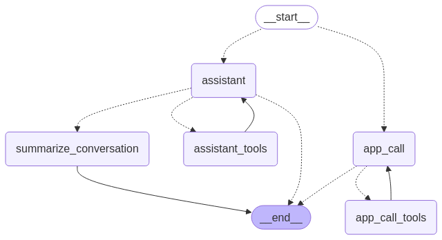

# Context-Aware LLM Navigation Interface for Accessibility Apps

This repository houses an **intelligent, context-aware, natural language navigation interface** (referred to as **"the interface"**), and is designed to enhance (inter)operability with accessibility apps. It utilizes the power of [Large Language Models (LLMs)](https://en.wikipedia.org/wiki/Large_language_model) and provides an API that supports both human/user and system/app inputs, back-and-forth natural language communication, data exchange to and from apps, and building contexts about the user's intentions.

The purpose of the system is to provide a way for users to communicate with accessibility apps in natural language, as opposed to using a [Graphical User Interface (GUI)](https://en.wikipedia.org/wiki/Graphical_user_interface) or fixed and unnatural commands via [speech recognition](https://en.wikipedia.org/wiki/Speech_recognition). The API can be integrated into accessibility apps in any way imaginable, allowing the users to question the interface on data that may reside in the app or perform actions such as executing a certain function or changing data within the app.

## Usage Example

The interface is currently setup to work with the [Natural Language Interface (NLI)](https://github.com/StudyProject-NLI/NLInterface). NLI is an accessibility app designed to help users shop in supermarkets. It operates a bracelet with tactile elements, which can guide the user's hands to grasp various objects.

1. **Client (User)**: I'm looking for coffee.
2. **Server (Assistant)**: `looks at context history, explores possible relevant app functions, and returns` Are you looking to buy coffee in a supermarket, your coffee somewhere at home, or want to add coffee to your grocery list?
3. **Client (User)**: I'm out of coffee.
4. **Server (Assistant)**: `assumes the user wants to add to a grocery list and returns its appropriate label and that additional app data is required` label=grocery-list, additional-data-required=True
5. **Client (App)**: `sends current grocery list in any reasonable format, like` 6x Milk, 3x Apple
6. **Server (App Call)**: `reads instruction of grocery list and returns` [+1]Coffee
7. **Client (App)**: `executes the addition of coffee to the grocery list by means of, for instance, a regular expression, and says` Coffee added to your grocery list.

## Architecture

The interface is built with modularity and scalability in mind. While the current implementation integrates with NLI, it can easily be adapted to support other accessibility applications.

The assistant is powered by [LangGraph](https://www.langchain.com/langgraph), a state-of-the-art LLM Python framework designed for creating multi-agent workflows with detailed flow customization.

The graph of the interface consists of several nodes:


### Where:

- **Assistant**: determines what app functions are relevant based on the context of the user's command, main interfacing agent.
- **App Call**: executes predefined instructions as described in the function.
- Tools:
  - **Function Library**: searches the document space (vector embeddings) for the most relevant functions.
  - **Date/time**: simply obtains the current date and time.
- **Summarize**: to keep track of the user's context and allow an infinite context window.

### App Functionalities

The core of the system works with [word embeddings](https://en.wikipedia.org/wiki/Word_embedding) in a vector store database. Semantic similarity search is performed to identify context-relevant functions.

For each app functionality, the following is defined:

- The ID of the app the function belongs to (must be unique),
- Whether the description is a `function` or `app` description,
- Label the interface will return (must be unique to the app),
- Detailed description of the functionality,
- Instructions for the interface when this functionality is called,
- Whether the interface needs additional data from the app or not.

Simply describe this in plaintext and the interface will do the heavy lifting for you. Add the functionality in [tools.py](tools.py) within the `docs` list. An example of a grocery list functionality could be:

```python
Document(
   page_content="""
   A list where a user can add and remove products from that they want to acquire at a supermarket.
   The app will return the current grocery list as additional data.
   Return the product(s) that need to be added or removed, prefixed with either + (to add) or - (to remove), including the amount.
   Or if the user wants to know what's on the grocery list, then name the items that are on the grocery list in natural language.
   Interpret what to add or remove based on the user's input and current grocery list sent as additional data.

   Example:
   The app might send the current grocery list as: [5]Elstar Apple; [4]Banana; [1]Quaker Oats
   The user might say: "I need 6 more apples and 2 packs of milk, but don't need the oats anymore."
   You will respond with: [+4]Elstar Apple; [2]Milk; [-1]Quaker Oats
   """,
   metadata={"app_id": 1, "type": "function", "label": "grocery-list", "additional-data-required": True},
)
```

### Flowchart

The following flowchart illustrates the high-level logic behind the interface. It shows how the system processes user input, determines intent, queries app-relevant functionalities, and coordinates with external accessibility apps.

<details>
<summary>🧭 Click to expand the interaction flowchart</summary>


</details>

## Getting Up and Running

### Prerequisites

- [Python](https://www.python.org/) 3.10+ installed,
- API keys from [LangSmith](https://www.langchain.com/langsmith) and [OpenAI](https://platform.openai.com/).

### Installation

1. Clone the repository:

   ```bash
   git clone https://github.com/RillJ/llm-app-interface
   cd llm-app-interface
   ```

2. Create a virtual Python environment:

   ```bash
   python -m venv venv
   ```

   Activate the virtual environment:

   - **On Windows:**
     ```bash
     venv\Scripts\activate
     ```
   - **On macOS/Linux:**
     ```bash
     source venv/bin/activate
     ```

3. Install the required Python packages:

   ```bash
   pip install -r requirements.txt
   ```

4. Set up your environment variables by creating a `.env` file in the project root and filling in the required fields:

   ```env
   LANGCHAIN_TRACING_V2=true
   LANGCHAIN_API_KEY=your_langchain_api_key_here
   OPENAI_API_KEY=your_openai_api_key_here
   SECRET_KEY=your_secret_key_here
   ```

   To generate a secure `SECRET_KEY`, you can run:

   ```bash
   openssl rand -hex 32
   ```

### Usage

1. Start the server locally:

   ```bash
   python serve.py
   ```

   By default, the API will be accessible at:

   ```
   http://localhost:8000/llm-app-interface
   ```

   To change this, refer to the bottom of the [serve.py](serve.py) file.

2. The application currently holds one user for development purposes:

   - **Username**: `johndoe`
   - **Password**: `secret`

3. Use the `/token` endpoint to generate a JWT token for authentication:
   ```bash
   curl -X POST "http://localhost:8000/token" -H "Content-Type: application/x-www-form-urlencoded" -d "username=johndoe&password=secret"
   ```

## API Endpoints

- **`/llm-app-interface/invoke`**  
  The primary endpoint for invoking LLM interactions.

  **Example Request**:

  ```bash
  curl -X POST "http://localhost:8000/llm-app-interface/invoke" \
       -H "Authorization: Bearer <your_jwt_token>" \
       -H "Content-Type: application/json" \
       -d '{"messages": "Hello, can you assist me?"}'
  ```

  **Note**: Ensure you include a valid JWT token for authorization.

## Security

- **OAuth2** is implemented for user authentication. The `SECRET_KEY` is used to sign and validate JWT tokens.
- Currently, one user (`johndoe`) is supported. For more users, you can extend the `fake_users_db` or integrate with a proper database.

## Contributing

We welcome contributions! Please submit a pull request or open an issue for discussion.
